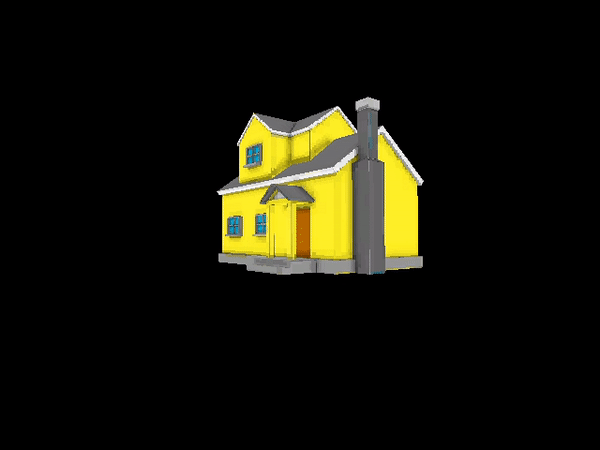

# Software Rendering Minimal Example

Compile with Visual Studio command line (x64 Native Tools Command Prompt):

cl Demo.c user32.lib gdi32.lib -O2

Low poly house:

https://sketchfab.com/3d-models/low-poly-house-796232a307d24b6881f4f42476058701

